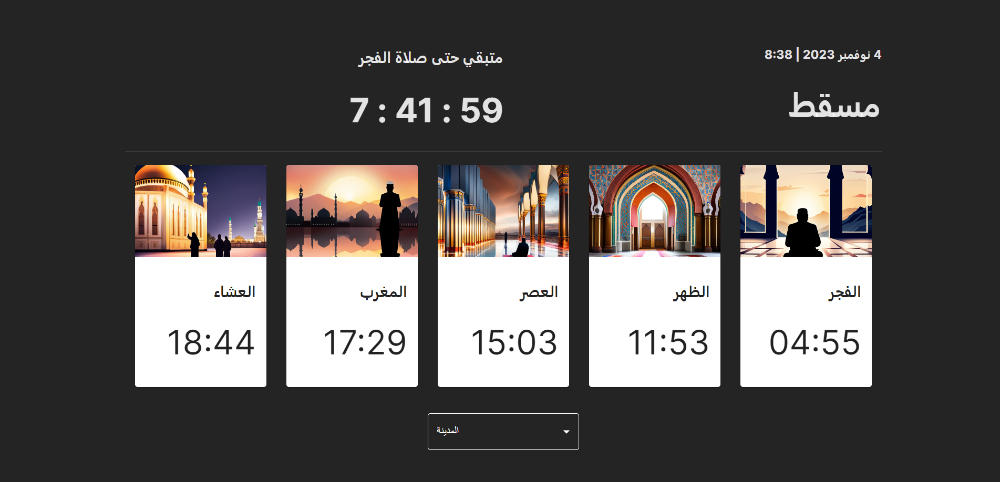
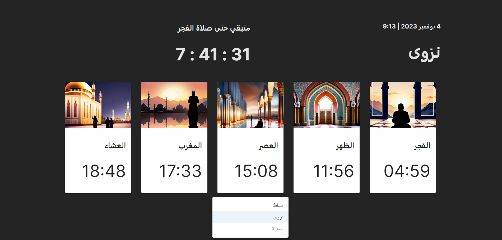

# Prayers timing 

### This website displays the time of each prayer in several cities and also displays the time remaining for the next prayer. *React.Js* was used with *API*.

Tools & libraries
1. vite 3
2. material UI
3. Google font
4. https://aladhan.com/prayer-times-api#GetTimingsByCity - API
5. axios - API
6. moment.js - time

